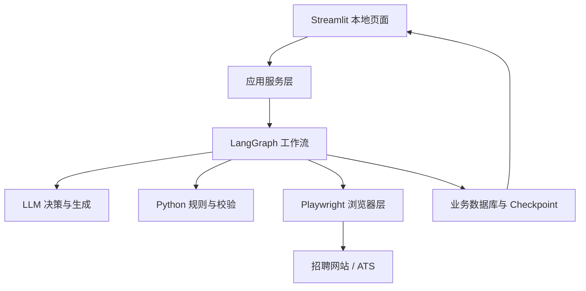
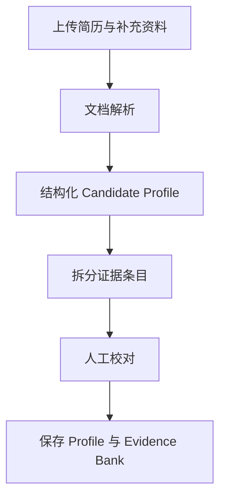
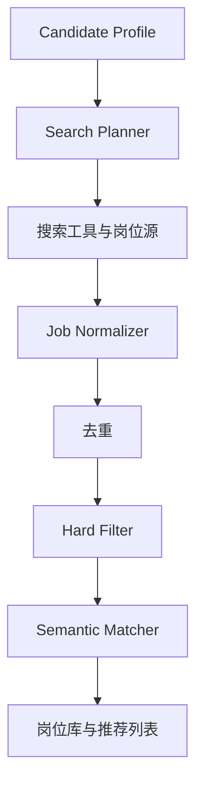
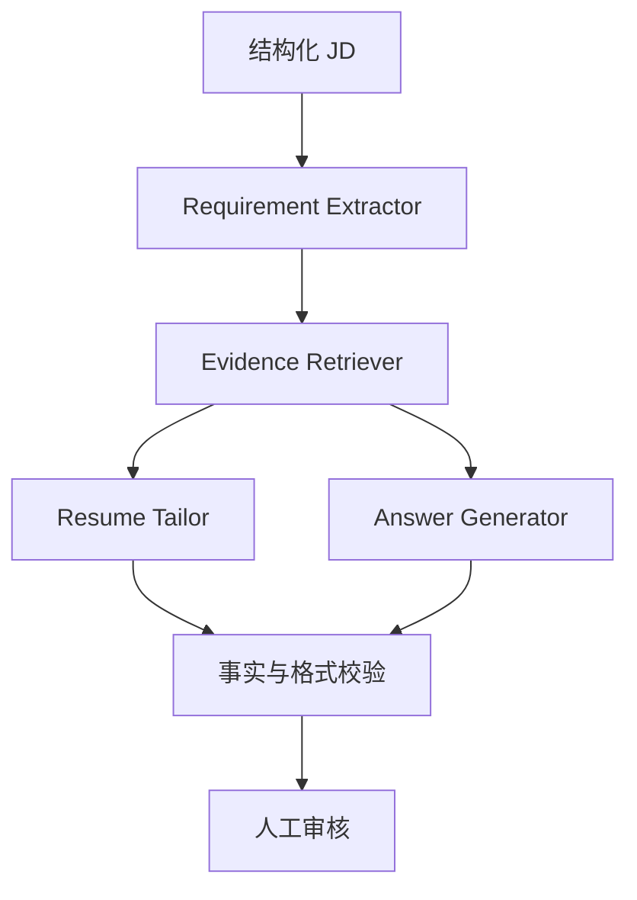
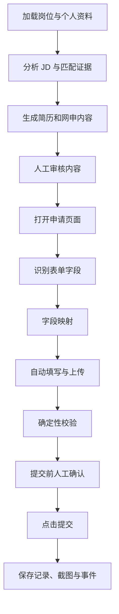

# 基于 LangGraph 的秋招投递智能体：详细设计方案

> 目标：构建一个面向秋招求职的本地智能系统，实现岗位发现、岗位匹配、材料定制、网申辅助、投递留档和进度追踪，并通过本地页面提供可视化与人工审批。

## 1. 项目目标

系统需要完成以下五项核心任务：

1. 根据个人简历和求职意向，自动搜索并推荐匹配的公司与岗位。
2. 自动识别网申表单、填写信息、上传材料，并在用户确认后提交。
3. 保存每次投递使用的岗位信息、简历版本、网申答案、页面截图和状态变化。
4. 针对不同岗位的 JD，在真实经历范围内优化简历内容和网申答案。
5. 提供本地可视化页面，用于岗位筛选、内容审核、提交审批和进度管理。

本项目不应被设计成“一个大模型控制全部操作”，而应采用职责明确的工程架构：

| 任务类型 | 负责模块 |
|---|---|
| 工作流编排、暂停与恢复 | LangGraph |
| JD 解析、语义匹配、内容生成 | LLM |
| 确定性校验、过滤、去重 | Python 规则 |
| 网页识别与操作 | Playwright |
| 数据、版本和事件存储 | SQLite / PostgreSQL |
| 高风险操作确认 | Human-in-the-loop |
| 本地管理与交互 | Streamlit |

---

## 2. 设计原则

### 2.1 搜索、生成、填写与提交分层

岗位搜索、材料生成、网页填写和最终提交应是相互独立的阶段。任一阶段失败，都不应破坏已经保存的数据，也不应导致系统越过人工审批直接提交。

### 2.2 网页只是输入，Schema 才是内部协议

不同网站的页面结构随时可能变化。系统应先把网页、JD 和表单转换为统一的结构化对象，再由后续模块处理。

### 2.3 所有求职内容必须有事实依据

系统只能重新组织、压缩或强调已有真实经历，不得为迎合 JD 编造技能、业绩或项目。每段生成内容都要能够追溯到个人资料中的证据条目。

### 2.4 高风险操作必须人工确认

以下动作必须暂停工作流并等待用户操作：

- 首次登录招聘网站；
- 短信、滑块、图形验证码或其他人机验证；
- 对事实依据不足的开放题答案作确认；
- 点击最终“提交申请”按钮之前；
- 撤回申请、覆盖材料等不可轻易恢复的操作。

### 2.5 先做单站点闭环，再扩展 Adapter

第一版只支持一个常用招聘系统，先跑通“识别—填写—检查—审批—提交—留档”的完整流程，再逐步扩展 Moka、北森、Workday、Greenhouse 等平台。

---

## 3. 总体架构



建议将系统拆成四条相对独立的业务工作流，再由总调度层调用：

1. **Profile Graph**：解析简历、整理求职意向、构建个人证据库。
2. **Job Discovery Graph**：搜索岗位、结构化 JD、去重、过滤、评分和入库。
3. **Application Graph**：生成定制材料、识别并填写表单、人工确认、提交和留档。
4. **Tracking Graph**：追踪招聘网站、邮件和人工录入的状态变化。

总调度器 `JobAgentGraph` 负责识别任务类型并调用相应子图，但不把所有逻辑塞入一条超长 Graph。

---

## 4. 核心业务对象

### 4.1 Candidate Profile

不要让系统在每次投递时重新读取 PDF 简历。首次导入后，应转换成结构化个人档案。

```python
from pydantic import BaseModel


class JobPreference(BaseModel):
    roles: list[str]
    locations: list[str]
    industries: list[str] = []
    graduation_year: int | None = None
    salary_expectation: str | None = None
    excluded_companies: list[str] = []


class CandidateProfile(BaseModel):
    candidate_id: str
    basic_info: dict
    education: list[dict]
    internships: list[dict]
    projects: list[dict]
    skills: list[str]
    awards: list[dict]
    job_preferences: JobPreference
    answer_bank: dict[str, str]
```

敏感字段如身份证号、手机号、家庭住址等，应与普通求职知识分开存储，并避免发送给不需要这些字段的模型调用。

### 4.2 Resume Evidence Bank

证据库是简历定制和网申问答的事实边界。

```json
{
  "evidence_id": "ev_003",
  "experience_id": "exp_002",
  "category": "llm_finetuning",
  "content": "使用 Axolotl 对 Qwen3 进行领域 SFT，并构建评测集评估效果。",
  "skills": ["Qwen3", "Axolotl", "SFT", "模型评测"],
  "metrics": [],
  "source": "基础简历-v1",
  "verified": true
}
```

生成结果应保留 `source_evidence_ids`。如果 JD 要求 RAG，而证据库没有相关内容，系统应明确标记为能力缺口，而不是生成“熟练掌握 RAG”。

### 4.3 JobPosting

```python
class JobPosting(BaseModel):
    job_id: str
    company: str
    title: str
    location: str | None
    url: str
    source: str
    raw_jd: str
    responsibilities: list[str]
    requirements: list[str]
    preferred_qualifications: list[str] = []
    skills: list[str]
    education_requirement: str | None
    graduation_requirement: str | None
    experience_requirement: str | None
    deadline: str | None
    discovered_at: str
```

### 4.4 MatchResult

```python
class MatchResult(BaseModel):
    job_id: str
    hard_filter_passed: bool
    overall_score: float
    dimension_scores: dict[str, float]
    strengths: list[str]
    gaps: list[str]
    evidence_ids: list[str]
    recommendation: str
    explanation: str
```

### 4.5 FormField

```python
class FormField(BaseModel):
    field_id: str
    label: str | None
    field_type: str
    required: bool
    options: list[str] = []
    locator_hint: dict
    mapped_source: str | None = None
    proposed_value: str | None = None
    confidence: float = 0.0
    needs_review: bool = False
```

### 4.6 ApplicationRecord

```python
class ApplicationRecord(BaseModel):
    application_id: str
    candidate_id: str
    job_id: str
    status: str
    application_url: str
    resume_version_id: str | None
    submitted_at: str | None
    last_updated_at: str
```

---

## 5. Profile Graph：个人资料与证据库

### 5.1 工作流



### 5.2 处理内容

- 解析 PDF、DOCX 或手动输入的简历；
- 识别教育、实习、项目、技能、获奖和证书；
- 让用户补充求职方向、地点、行业和排除条件；
- 将长经历拆为可检索、可引用的事实证据；
- 对含糊内容或数字指标进行人工确认；
- 建立常见网申问题答案库。

### 5.3 Answer Bank

常见问题不应每次从零生成。可建立如下结构：

```python
class AnswerTemplate(BaseModel):
    question_type: str
    canonical_question: str
    default_answer: str
    source_evidence_ids: list[str]
    versions: list[dict] = []
```

典型问题包括：自我介绍、选择公司的原因、选择岗位的原因、职业规划、个人优势、困难与解决方式、项目经历、实习经历、期望地点和薪资等。

---

## 6. Job Discovery Graph：岗位发现与匹配

### 6.1 工作流



### 6.2 Search Planner

Search Planner 根据岗位方向、毕业年份、地点和技能组合生成多组查询：

```json
{
  "queries": [
    "2027届 AI Agent 工程师 校招",
    "2027届 大模型应用工程师 校招",
    "应届生 LangGraph Agent 开发",
    "LLM 应用算法工程师 成都 深圳"
  ],
  "sources": ["公司招聘官网", "ATS页面", "搜索引擎"],
  "time_range_days": 7
}
```

岗位发现优先使用搜索接口、公开招聘页或结构化数据。Playwright 更适合必须渲染或登录后才能读取的页面，不应承担全部大规模岗位搜索。

### 6.3 去重策略

可组合以下字段生成指纹：

- 公司标准名；
- 规范化岗位名；
- 工作地点；
- JD 文本哈希；
- 官方岗位编号；
- 规范化 URL。

同一岗位出现在多个来源时，应合并来源，不要创建多条投递记录。

### 6.4 两阶段匹配

#### 第一阶段：Hard Filter

使用确定性规则过滤：

- 毕业年份不符；
- 学历要求不符；
- 地点完全不接受；
- 岗位要求多年正式工作经验；
- 专业或证书存在不可替代的硬性要求；
- 已截止或链接失效；
- 公司在排除列表中。

#### 第二阶段：Semantic Matching

对通过硬过滤的岗位进行语义评分。例如：

| 维度 | 建议权重 |
|---|---:|
| 岗位方向 | 30% |
| 技能匹配 | 25% |
| 项目经历 | 20% |
| 实习经历 | 15% |
| 行业与地点偏好 | 10% |

结果不仅给分数，还必须给出证据和缺口：

```json
{
  "overall_score": 86,
  "strengths": [
    "LangGraph Agent 开发经历与岗位职责直接匹配",
    "具备 Qwen SFT 和模型评测经历"
  ],
  "gaps": [
    "证据库中缺少明确的 RAG 项目经历"
  ],
  "evidence_ids": ["ev_003", "ev_007"],
  "recommendation": "建议投递"
}
```

---

## 7. JD 定制与材料生成

### 7.1 处理流程



### 7.2 Requirement-to-Evidence 映射

系统先把 JD 拆成具体要求，再逐条检索个人证据：

| JD 要求 | 证据匹配 | 处理方式 |
|---|---|---|
| 熟悉 LLM Agent | 道路养护智能体项目 | 优先展示 |
| 熟悉 LangGraph | LangGraph 工作流开发 | 强化关键词与职责 |
| 有模型微调经验 | Qwen3 + Axolotl SFT | 强调数据、训练与评测 |
| 熟悉 RAG | 未找到 | 标记缺口，不生成虚假经历 |

### 7.3 ResumeVersion

每个岗位都可以生成独立的简历版本：

```text
resume_version_id = <job_id>-resume-v1
```

系统保存：

- 基础简历版本；
- 目标岗位 ID；
- 修改前后内容；
- 使用的证据 ID；
- 生成时间；
- 用户修改记录；
- 最终 PDF 文件及哈希值。

所谓“优化”主要包括：

- 调整已有经历的排列顺序；
- 用 JD 中的规范术语描述真实经历；
- 将最相关的职责与成果提前；
- 压缩与目标岗位关系较弱的内容；
- 在不改变事实的前提下提高表达清晰度。

### 7.4 网申答案生成

新问题先经过问题分类：

```text
新问题 → Question Classifier → Answer Bank → JD定制 → 证据校验 → 用户审核
```

最终答案应保存以下元数据：

- 原始问题；
- 问题类型；
- 答案正文；
- 字数限制；
- 引用的证据 ID；
- 模型生成版本；
- 用户修改后的最终版本。

---

## 8. Application Graph：自动填写与提交

### 8.1 完整流程



### 8.2 LangGraph State

```python
from typing import TypedDict


class JobAgentState(TypedDict):
    candidate_id: str
    task_type: str
    job: dict | None
    match_result: dict | None
    resume_version_id: str | None
    form_fields: list[dict]
    answers: dict[str, str]
    current_url: str | None
    application_id: str | None
    stage: str
    pending_action: str | None
    validation_errors: list[str]
    errors: list[str]
```

### 8.3 浏览器 Agent 的内部结构

浏览器模块不应让 LLM直接“看页面后自由点击”，而应采用结构化流水线：

```text
PageAnalyzer
    ↓
FormExtractor
    ↓
FieldMapper
    ↓
FormFiller
    ↓
Validator
    ↓
Submitter
```

其中：

- `PageAnalyzer` 判断页面类型、登录状态、是否存在验证码及当前步骤；
- `FormExtractor` 提取 label、role、placeholder、选项、必填状态等；
- `FieldMapper` 将表单字段映射到个人资料或生成答案；
- `FormFiller` 执行填写、选择和文件上传；
- `Validator` 检查遗漏、格式错误和异常提示；
- `Submitter` 只能在获得人工批准后执行最终提交。

### 8.4 字段映射置信度

建议设置三档：

- `confidence >= 0.90`：可自动填写，但仍在预览中展示；
- `0.60 <= confidence < 0.90`：填写后要求用户检查；
- `confidence < 0.60`：不自动填写，进入待处理列表。

身份证号、薪资、家庭信息、服从调剂、是否接受外派等敏感或高影响字段，即使置信度较高，也建议强制确认。

---

## 9. 招聘网站 Adapter 体系

不要设计一个试图适配所有网站的 `auto_apply_any_website()`。建议定义统一接口：

```python
from abc import ABC, abstractmethod


class ApplicationAdapter(ABC):
    @abstractmethod
    async def detect(self) -> bool: ...

    @abstractmethod
    async def login(self) -> None: ...

    @abstractmethod
    async def parse_form(self) -> list[dict]: ...

    @abstractmethod
    async def fill_form(self, data: dict) -> None: ...

    @abstractmethod
    async def upload_resume(self, path: str) -> None: ...

    @abstractmethod
    async def validate(self) -> list[str]: ...

    @abstractmethod
    async def submit(self) -> None: ...
```

目录可以按平台扩展：

```text
browser/adapters/
├── base.py
├── generic.py
├── moka.py
├── beisen.py
├── workday.py
├── greenhouse.py
└── company_custom.py
```

通过工厂选择 Adapter：

```python
adapter = AdapterFactory.create(application_url)
await adapter.fill_form(application_data)
```

页面变化时只修复对应 Adapter，不影响上层业务逻辑。

---

## 10. 登录、验证码与人工审批

### 10.1 登录态

首次访问时由用户手动登录，再保存 Playwright 的浏览器状态。状态文件可能包含敏感 Cookie，必须：

- 保存在本地受控目录；
- 加入 `.gitignore`；
- 不上传到代码仓库；
- 不输出到日志；
- 设置过期检测和手动重登入口。

示例目录：

```text
.playwright/auth/
├── moka.json
├── beisen.json
└── workday.json
```

### 10.2 验证码

系统不自动绕过验证码。检测到验证码时：

```text
fill_form → captcha_detected → interrupt() → 用户完成验证 → 恢复 Graph
```

### 10.3 提交前确认

本地页面展示：

- 公司和岗位；
- 使用的简历版本；
- 自动填写字段和待确认字段；
- 开放题答案；
- 校验警告；
- 提交前截图。

用户可选择：

- 确认提交；
- 修改内容；
- 暂存稍后处理；
- 取消本次申请。

---

## 11. Checkpoint 与故障恢复

网申可能因验证码、网络错误、页面超时或人工修改而暂停，因此每个申请都应拥有稳定的 LangGraph `thread_id`：

```python
config = {
    "configurable": {
        "thread_id": f"application-{application_id}"
    }
}
```

开发阶段可使用 SQLite Checkpointer；多用户或正式部署时切换到 PostgreSQL。Checkpoint 负责保存工作流运行状态，业务数据库负责保存岗位、简历版本、投递记录和事件，两者职责不能混淆。

节点设计应尽量幂等。例如重新运行 `save_application_record` 时，不应重复创建申请，而应根据 `application_id` 更新或跳过。

---

## 12. 数据库设计

建议至少建立以下数据表。

### 12.1 用户与材料

#### `candidates`

- `id`
- `basic_info_json`
- `job_preferences_json`
- `created_at`
- `updated_at`

#### `resumes`

- `id`
- `candidate_id`
- `name`
- `source_file_path`
- `content_hash`
- `created_at`

#### `resume_evidence`

- `id`
- `candidate_id`
- `experience_id`
- `category`
- `content`
- `skills_json`
- `source_resume_id`
- `verified`

#### `resume_versions`

- `id`
- `candidate_id`
- `job_id`
- `base_resume_id`
- `content_json`
- `source_evidence_ids_json`
- `file_path`
- `content_hash`
- `created_at`

### 12.2 岗位与匹配

#### `jobs`

- `id`
- `company`
- `title`
- `location`
- `url`
- `source`
- `raw_jd`
- `normalized_json`
- `fingerprint`
- `deadline`
- `discovered_at`

#### `job_matches`

- `id`
- `candidate_id`
- `job_id`
- `hard_filter_passed`
- `overall_score`
- `details_json`
- `created_at`

### 12.3 投递与追踪

#### `applications`

- `id`
- `candidate_id`
- `job_id`
- `status`
- `application_url`
- `resume_version_id`
- `submitted_at`
- `last_updated_at`

#### `application_answers`

- `id`
- `application_id`
- `question`
- `question_type`
- `answer`
- `source_evidence_ids_json`
- `is_user_edited`

#### `application_events`

- `id`
- `application_id`
- `event_type`
- `from_status`
- `to_status`
- `source`
- `details_json`
- `occurred_at`

#### `browser_runs`

- `id`
- `application_id`
- `adapter_name`
- `stage`
- `success`
- `error_code`
- `screenshot_path`
- `created_at`

---

## 13. 投递快照与审计

提交时保存完整快照：

```text
application_snapshots/
└── <application_id>/
    ├── job.json
    ├── match_result.json
    ├── application.json
    ├── answers.json
    ├── resume.pdf
    ├── before_submit.png
    ├── after_submit.png
    └── manifest.json
```

`manifest.json` 建议记录：

- JD 哈希；
- 简历文件哈希；
- 页面 URL；
- Adapter 名称和版本；
- 提交时间；
- 用户审批记录；
- 每个字段的来源；
- 最终提交结果。

日志中不得写入密码、完整 Cookie、身份证号或其他不必要的敏感数据。

---

## 14. Tracking Graph：投递进度追踪

### 14.1 标准状态

```text
DISCOVERED
  → SHORTLISTED
  → PREPARING
  → READY_TO_APPLY
  → SUBMITTED
  → ONLINE_ASSESSMENT
  → INTERVIEW
  → OFFER

终止状态：REJECTED / WITHDRAWN / CLOSED
```

### 14.2 状态来源

- 招聘网站中的申请状态；
- 招聘邮件中的笔试、面试、拒信或 Offer 通知；
- 用户手动修改；
- 系统根据提交成功页生成的初始事件。

多个来源冲突时，不应静默覆盖。系统应保留原事件，并让用户确认最终状态。

### 14.3 邮件集成

后续可接入 Gmail 或 Outlook，将招聘邮件解析为：

```text
邮件 → 公司与岗位识别 → 事件分类 → 关联 application_id → 更新状态
```

邮件自动识别只负责建议状态变更；置信度不足或无法对应具体岗位时，应进入待确认队列。

---

## 15. 本地页面设计

第一阶段建议使用 Streamlit，以降低前后端分离的开发成本。

### 15.1 页面列表

```text
Dashboard
岗位发现
岗位详情
待审批投递
投递记录
面试进度
简历中心
个人资料
系统日志
设置
```

### 15.2 Dashboard

展示：

- 本周发现岗位数；
- 高匹配岗位数；
- 待审批数；
- 已投递数；
- 笔试、面试和 Offer 数；
- 最近状态变化；
- 即将截止岗位。

### 15.3 岗位详情页

核心区域包括：

- 原始 JD 与结构化要求；
- 总体匹配分数及分项分数；
- 匹配优势、能力缺口及证据来源；
- 推荐简历版本；
- 生成定制简历；
- 生成网申答案；
- 加入待投池；
- 启动自动填写。

### 15.4 待审批投递页

展示浏览器填写结果、字段来源、风险项、简历预览和页面截图，并允许用户修改字段后恢复 LangGraph 工作流。

---

## 16. Agent 与 Node 的合理划分

系统可以在业务层抽象为七个 Agent：

| Agent | 主要职责 |
|---|---|
| Search Agent | 规划并执行岗位搜索 |
| JD Agent | 抽取并规范化 JD |
| Match Agent | 规则过滤与语义匹配 |
| Resume Agent | 证据检索与简历定制 |
| Application Agent | 网申问题分类与回答生成 |
| Browser Agent | 页面解析、填写、校验与提交 |
| Tracker Agent | 追踪申请状态变化 |

但 Agent 不等于 LangGraph Node。一个 Browser Agent 内部仍会包含 `detect_page`、`extract_form`、`map_fields`、`fill_fields` 和 `validate` 等多个节点。只有真正需要语言理解或复杂语义决策的部分才调用 LLM。

---

## 17. 推荐工程目录

```text
job_agent/
├── app/
│   ├── main.py
│   └── pages/
│       ├── dashboard.py
│       ├── jobs.py
│       ├── job_detail.py
│       ├── approvals.py
│       ├── applications.py
│       ├── resumes.py
│       └── settings.py
├── agents/
│   ├── job_search/
│   │   ├── planner.py
│   │   ├── searcher.py
│   │   ├── normalizer.py
│   │   └── matcher.py
│   ├── resume/
│   │   ├── jd_parser.py
│   │   ├── evidence_retriever.py
│   │   └── resume_tailor.py
│   ├── application/
│   │   ├── question_classifier.py
│   │   ├── answer_generator.py
│   │   └── form_mapper.py
│   └── tracking/
│       └── status_agent.py
├── graphs/
│   ├── profile_graph.py
│   ├── job_discovery_graph.py
│   ├── application_graph.py
│   ├── tracking_graph.py
│   └── main_graph.py
├── browser/
│   ├── manager.py
│   ├── session_store.py
│   └── adapters/
│       ├── base.py
│       ├── factory.py
│       ├── generic.py
│       ├── moka.py
│       ├── beisen.py
│       ├── workday.py
│       └── greenhouse.py
├── schemas/
│   ├── candidate.py
│   ├── evidence.py
│   ├── job.py
│   ├── application.py
│   ├── browser.py
│   └── resume.py
├── services/
│   ├── profile_service.py
│   ├── job_service.py
│   ├── resume_service.py
│   ├── application_service.py
│   └── tracking_service.py
├── storage/
│   ├── database.py
│   ├── models.py
│   ├── checkpoint.py
│   └── repositories/
├── prompts/
│   ├── jd_parse.md
│   ├── job_match.md
│   ├── resume_tailor.md
│   └── application_answer.md
├── data/
│   ├── resumes/
│   ├── application_snapshots/
│   └── auth/
├── tests/
│   ├── unit/
│   ├── integration/
│   ├── fixtures/
│   └── e2e/
├── config/
│   └── settings.py
├── migrations/
├── .env.example
├── .gitignore
├── pyproject.toml
└── README.md
```

---

## 18. 技术栈建议

| 模块 | 推荐技术 |
|---|---|
| Agent 工作流 | LangGraph |
| LLM 调用封装 | LangChain 或轻量自建 Client |
| 结构化输出 | Pydantic |
| 浏览器自动化 | Playwright |
| API 层 | FastAPI |
| MVP 数据库 | SQLite |
| 正式数据库 | PostgreSQL |
| ORM 与迁移 | SQLAlchemy + Alembic |
| LangGraph Checkpoint | SqliteSaver → PostgresSaver |
| 本地 UI | Streamlit |
| PDF / DOCX 解析 | PyMuPDF / python-docx |
| 检索 | 初期关键词与元数据检索，必要时再引入 FAISS / Chroma |
| 日志 | 标准 logging 或 Loguru |
| Trace | LangSmith，可选 |
| 测试 | pytest + Playwright Test Fixtures |

向量数据库不是第一版的必需组件。个人证据量有限时，结构化标签、关键词和小规模语义检索已经足够，避免过早增加复杂度。

---

## 19. 开发路线

### V0.1：求职数据中心

目标：先建立可靠的数据底座。

- 初始化工程目录和配置；
- 设计 Pydantic Schema；
- 建立 SQLite 和迁移；
- 导入简历并生成 Candidate Profile；
- 建立 Evidence Bank；
- 完成个人资料、简历和投递记录页面。

验收标准：能够在页面中查看和编辑个人资料、证据条目及空的投递看板。

### V0.2：岗位发现 Agent

- Search Planner；
- 接入一个岗位搜索来源；
- JD 结构化；
- 岗位去重；
- Hard Filter；
- 证据化匹配评分；
- 推荐岗位列表。

验收标准：输入求职意向后能够得到一批去重岗位，每个岗位都有可解释的匹配结果。

### V0.3：JD 定制 Agent

- Requirement Extractor；
- Evidence Retriever；
- Resume Tailor；
- Answer Bank；
- 网申答案生成；
- 事实校验和人工审核。

验收标准：针对一个岗位生成定制材料，所有关键表述都能追溯到证据条目。

### V0.4：单站点半自动投递

- Playwright Browser Manager；
- 一个目标 ATS Adapter；
- 登录态复用；
- 表单识别与字段映射；
- 自动填写和上传；
- 验证码暂停；
- 提交前审批；
- 快照和事件留档。

验收标准：在测试账号或安全测试环境中完成一次可恢复、可审计的投递闭环。

### V0.5：Adapter 扩展与稳定性

- 增加更多 ATS Adapter；
- 页面变化监测；
- 失败重试与错误分类；
- E2E 回归测试；
- 提升字段映射覆盖率。

### V1.0：完整秋招工作流

- 定时岗位发现；
- 待投池与批量材料准备；
- 多站点半自动投递；
- 招聘邮件解析；
- 状态自动建议更新；
- Dashboard、提醒与统计分析。

---

## 20. 测试策略

### 20.1 单元测试

- JD 结构化输出是否符合 Schema；
- Hard Filter 边界条件；
- 去重指纹是否稳定；
- 匹配分数计算；
- Evidence Retriever 是否返回真实证据；
- 字段映射规则；
- 状态机是否拒绝非法跳转。

### 20.2 集成测试

- Profile → Evidence Bank；
- Job Search → Normalize → Match → Save；
- JD → ResumeVersion → Answer Generation；
- Application Graph 的 interrupt 与恢复；
- 数据库记录和快照一致性。

### 20.3 浏览器 E2E 测试

为每个 Adapter 保存脱敏的 HTML Fixture 或搭建本地测试表单，测试：

- 字段识别；
- 下拉框、日期、单选和多选；
- 文件上传；
- 多步骤表单；
- 必填项错误；
- 页面结构变化；
- 提交前拦截。

自动测试默认禁止真实提交，可使用 `dry_run=True` 或测试页面验证提交逻辑。

---

## 21. 安全、合规与现实限制

### 21.1 隐私与凭证

- 密码尽量不由系统保存，优先手动登录并复用受保护的登录态；
- `.env`、认证状态和个人敏感数据不得提交 Git；
- 日志默认脱敏；
- 模型请求遵循最小数据原则；
- 提供本地数据删除和导出能力。

### 21.2 网站规则

招聘平台可能限制自动化访问。接入前应检查目标站点的服务条款、访问频率限制和机器人策略。不得绕过验证码、访问控制或其他安全机制。

### 21.3 内容真实性

系统应设置以下发布闸门：

- 生成内容不存在无来源的新事实；
- 数字、技术栈和职责均能定位到证据；
- 无证据的岗位要求被列为 gap；
- 用户修改后重新进行一致性检查；
- 最终提交内容和存档快照一致。

### 21.4 防止误投

- 设置每日最大提交数；
- 只允许投递用户已加入待投池的岗位；
- 最终提交必须人工批准；
- 同一岗位禁止重复投递；
- 公司黑名单和岗位排除规则在所有工作流中统一生效。

---

## 22. 第一阶段建议优先实现的闭环

第一阶段不要追求“全自动覆盖所有网站”，建议优先完成以下闭环：

```text
导入简历
  → 建立 Candidate Profile 与 Evidence Bank
  → 手动粘贴或搜索一个 JD
  → 结构化 JD
  → 输出证据化匹配报告
  → 生成定制简历内容和网申答案
  → 用户审核
  → 保存 ApplicationRecord
  → 在 Dashboard 中追踪状态
```

完成这个闭环后，再接入第一个 Playwright Adapter。这样即使浏览器自动化尚未完成，岗位分析、材料定制和投递管理部分也已经具有实际使用价值。

---

## 23. 项目成功指标

建议从以下指标评估系统，而不是只看“能否自动点击”：

| 指标 | 含义 |
|---|---|
| 岗位有效率 | 推荐岗位中满足硬条件且链接有效的比例 |
| 去重准确率 | 同一岗位是否被正确合并 |
| 匹配可解释率 | 匹配结论中有证据支持的比例 |
| 事实一致率 | 生成内容不存在虚构或证据冲突的比例 |
| 表单字段覆盖率 | 可正确识别并映射的字段比例 |
| 自动填写准确率 | 无需用户纠正的已填写字段比例 |
| 工作流恢复率 | 中断或失败后能够从 Checkpoint 恢复的比例 |
| 投递留档完整率 | 简历、答案、截图、时间和状态记录齐全的比例 |
| 人工节省时间 | 单次申请相较纯手工流程减少的时间 |

---

## 24. 官方参考文档

- [LangGraph Persistence](https://docs.langchain.com/oss/python/langgraph/persistence)
- [LangGraph Interrupts](https://docs.langchain.com/oss/python/langgraph/interrupts)
- [Playwright Locators](https://playwright.dev/python/docs/locators)
- [Playwright Authentication](https://playwright.dev/python/docs/auth)
- [Streamlit Session State](https://docs.streamlit.io/develop/api-reference/caching-and-state/st.session_state)

---

## 25. 最终结论

这个项目最合适的定位不是“自动海投机器人”，而是一个可审计、可恢复、有人类控制权的求职工作流系统：

```text
LangGraph 管流程
LLM 做语义理解和内容生成
Python 规则做确定性判断
Playwright 做网页操作
数据库保存事实与状态
Streamlit 提供交互界面
用户负责关键审批
```

工程实施时，应优先保证资料真实、状态可恢复、过程可追溯和提交可控制。在此基础上逐步提高自动化程度，系统才会真正稳定且可用。
